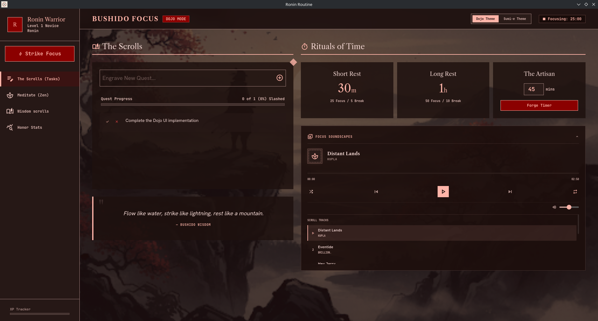

<p align="center" style="display:flex; align-items:center; justify-content:center; gap:18px;">
  
  <span style="font-size:2.5rem; font-weight:700;">Ronin Routine</span>
</p>

<p align="center" style="margin-top: 0.5rem; font-size:1.1rem; color:#555;">
  A productivity-first Linux desktop companion for task focus, progress tracking, and calm workflows.
</p>

<p align="center">
  
</p>

---

## 🧘 Productivity First

Ronin Routine is designed to help you stay in the zone without distraction.
It combines lightweight system tray access, actionable reminders, and a focus-friendly audio experience to make productive time feel natural.

## ✅ What You Can Do

- **Create tasks** and capture work with minimal friction
- **Track progress** so every task moves forward with clarity
- **Focus with music** by listening to pleasant songs while you work
- **Receive reminders** in the system tray to stay on schedule
- **Keep your workspace clean** with a non-intrusive app that stays tucked away until needed

## 🎯 Productivity Benefits

- Maintain flow with a calm, distraction-reduced interface
- Make work visible through task and progress tracking
- Use desktop notifications as gentle nudges, not interruptions
- Build routines around focus blocks with supportive audio

---

## 🔧 Core Features

- System tray launcher for quick access to controls
- Notification-driven reminders and alerts
- Embedded web bridge for rich, modern content
- A Linux `.desktop` file for seamless desktop integration
- Local `.venv` isolation so runtime files stay separate from source

---

## ✨ Preview

<p align="center">
  
</p>

---

## 🚀 Quick Start

```bash
./setup_env.sh
```

Then activate the environment and launch the app:

```bash
source .venv/bin/activate
python3 src/main.py
```

---

## 🧩 Requirements

- Python 3.8+
- `pip`
- `PySide6`
- `PySide6-Essentials`
- `PySide6-WebEngine`
- `requests`

Dependencies are defined in `requirements.txt`.

---

## 📁 Included Files

- `src/main.py` — application entry point
- `src/tray.py` — system tray management
- `src/notification.py` — notification delivery
- `src/web_bridge.py` — web integration layer
- `src/templates/index.html` — embedded UI template
- `ronin-routine.desktop` — Linux desktop launcher file

---

## 📌 Notes

- `.venv/` holds the local virtual environment.
- `db.json` and `error.txt` are runtime files and should not be committed.
- If Qt WebEngine fails on Debian/Ubuntu, install these dependencies:

```bash
sudo apt-get install -y libnss3 libasound2 libegl1 libxcomposite1 libxdamage1 libxrandr2 libxtst6 libxkbcommon0 libdbus-1-3 libxcb-xinerama0
```

---

## 🛡️ Project Vision

Ronin Routine is built to help focused users manage tasks, track progress, and keep productive time feeling calm and intentional.
